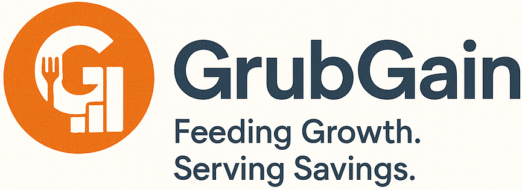

<div align="center">
  
  <h1>GrubGain</h1>
  <p><strong>The Ultimate AI-Powered Digital Marketing Engine for Restaurants</strong></p>
  <p>An enterprise-grade SaaS platform that automates social media marketing, content creation, and audience engagement, empowering restaurant owners to focus on what matters most: the food.</p>
</div>

---

## 🚀 Overview

GrubGain shifts the burden of marketing off the restaurateur's shoulders. By tightly integrating with **OpenAI's gpt-image-1.5** and **Meta's Graph API**, GrubGain provides an entire marketing agency inside a single dashboard.

From analyzing local festivals to automatically drafting high-converting Facebook and Instagram posts, scheduling them for maximum reach, and actively responding to customer comments—GrubGain handles it all autonomously.

## ✨ Core Features

### 🌆 Real-Time City Feed Intelligence

GrubGain actively analyzes the local environment of the restaurant. It pulls data on weather, local sporting events, and cultural festivals to dynamically suggest relevant marketing triggers.

### 🤖 AI Content Studio

A state-of-the-art content generation suite:

- **Native Image Generation:** Uses **gpt-image-1.5** for professional-quality marketing posters with crisp typography
- **Bilingual Capabilities:** Generates compelling captions in English and Hindi
- **Brand Voice Styling:** Supports tones like Modern, Elegant, Fun, Casual, and Professional
- **Campaign Types:** General Branding, Festival Greetings, Discount Offers, Menu Highlights
- **Hashtag & Emoji Controls:** Flexible hashtag and emoji generation options
- **High-Quality Output:** Uses high-quality image settings for production-ready assets

### 📅 Smart Scheduling & Predictive Analytics

- **Best Time to Post:** Uses historical engagement to suggest stronger posting windows
- **Direct Meta Publishing:** Publish/schedule to connected social platforms from the dashboard

### 💬 Auto-Reply AI (Meta Webhook Integration)

- Evaluates incoming comments in near real time
- Classifies comments using GPT-4o-mini (`POSITIVE`, `COMPLAINT`, `QUESTION`, etc.)
- Drafts contextual replies for approval queue workflows
- Supports one-click approval and native posting back to Meta

### ✂️ Content Cropping & Preview

- Front-end cropping workflow for social-friendly output
- Supports common social aspect ratios and previews before scheduling

---

## 🛠 Tech Stack

GrubGain is a monorepo built with modern production tooling.

### **Frontend (Client)**

- **Framework:** React 18 + Vite
- **State/Data:** `@tanstack/react-query`
- **Routing:** `react-router-dom`
- **HTTP:** `axios`

### **Backend (API Engine)**

- **Runtime:** Node.js + Express.js
- **Database:** PostgreSQL + Prisma ORM
- **Security:** JWT auth, `helmet`, CORS, cookie-based refresh flow
- **Logging:** `winston`
- **Integrations:** OpenAI, Meta Graph APIs, Google services

---

## 📂 Repository Structure

```text
GrubGain/
├── backend/                     # Express.js REST API
│   ├── api/
│   │   ├── controllers/         # Route logic & request handlers
│   │   ├── jobs/                # Cron schedulers
│   │   ├── middleware/          # Auth, errors, rate limiting
│   │   ├── routes/              # Express routes
│   │   ├── services/            # OpenAI / Meta / Google services
│   │   └── utils/               # Logger, crypto, helpers
│   ├── prisma/                  # Schema, migrations, seed
│   ├── public/uploads/          # Generated & uploaded media
│   ├── server.js                # API entry point
│   └── .env.example             # Backend env template
│
├── frontend/                    # React Vite client
│   ├── src/
│   │   ├── api/                 # API client wrappers
│   │   ├── components/          # Reusable UI
│   │   ├── context/             # Auth context
│   │   ├── pages/               # Route-level pages
│   │   └── utils/               # Utility helpers
│   └── .env.example             # Frontend env template
│
└── README.md
```

---

## 🚀 Getting Started

### Prerequisites

- **Node.js:** v18 or higher
- **Database:** PostgreSQL instance (local or cloud)
- **API Keys:**
  - OpenAI API key
  - Meta app credentials (for integrations/webhooks)
  - Optional Google credentials (for Google routes/features)

### 1. Clone the Repository

```bash
git clone https://github.com/jtgrubgainpvtltd/aisocialmedia.git
cd aisocialmedia
```

### 2. Backend Setup

```bash
cd backend
npm install
copy .env.example .env
```

Fill `backend/.env`, then run:

```bash
npm run db:generate
npx prisma db push
npm run dev
```

API runs at `http://localhost:5000`.

### 3. Frontend Setup

```bash
cd ../frontend
npm install
copy .env.example .env
npm run dev
```

App runs at `http://localhost:5173`.

---

## ⚙️ Environment Variables

### Backend (`backend/.env`)

Use `backend/.env.example` as source-of-truth. Key groups:

- Server: `NODE_ENV`, `PORT`, `CLIENT_URL`, `TRUST_PROXY`
- JWT/Auth: `JWT_SECRET`, `JWT_REFRESH_SECRET`, `JWT_EXPIRES_IN`, `JWT_REFRESH_EXPIRES_IN`
- Cookie policy: `AUTH_COOKIE_SAMESITE`, `AUTH_COOKIE_SECURE`
- DB/Crypto: `DATABASE_URL`, `ENCRYPTION_KEY`, `ENCRYPTION_IV`
- OpenAI: `OPENAI_API_KEY`
- Meta: `META_APP_ID`, `META_APP_SECRET`, `META_OAUTH_REDIRECT_URI`, `META_WEBHOOK_VERIFY_TOKEN`
- Optional Meta tokens: `META_USER_TOKEN`, `META_APP_TOKEN`, `META_ACCESS_TOKEN`
- Google: `GOOGLE_SERVICES_API_KEY`, `GOOGLE_OAUTH_CLIENT_ID`, `GOOGLE_OAUTH_CLIENT_SECRET`, `GOOGLE_OAUTH_REDIRECT_URI`
- Upload/limits: `UPLOADS_DIR`, `MAX_FILE_SIZE`
- Rate limiting/feature flags: `RATE_LIMIT_WINDOW_MS`, `RATE_LIMIT_MAX_REQUESTS`, `ENABLE_TEST_ENDPOINTS`
- Logging: `LOG_LEVEL`, `PRISMA_LOG_QUERIES`, `REQUEST_LOGGING`, `SCHEDULER_VERBOSE_LOGS`

### Frontend (`frontend/.env`)

```env
VITE_API_URL=http://localhost:5000/api/v1
```

---

## 🧪 Scripts

### Backend

```bash
npm run dev
npm start
npm run db:migrate
npm run db:deploy
npm run db:seed
npm run db:studio
npm run db:generate
npm run db:reset
```

### Frontend

```bash
npm run dev
npm run build
npm run preview
```

---

## 🔌 API Surface

Base path: `/api/v1`

- `/auth`
- `/restaurant`
- `/content`
- `/posts`
- `/analytics`
- `/trends`
- `/integrations`
- `/locations`
- `/google`
- `/replies`

Health check: `GET /health`

---

## 📱 Meta Webhook Setup (Auto-Reply)

1. Expose local backend:

```bash
ngrok http 5000
```

2. In Meta Developers → Webhooks:

- Callback URL: `https://<ngrok-url>/api/v1/replies/webhook`
- Verify token: same as `META_WEBHOOK_VERIFY_TOKEN`
- Subscribe relevant fields for comment events

3. Test by creating a comment on a connected page/post.

---

## 🔒 Security & Production Notes

- Never commit `.env` files.
- Use strong random JWT/encryption secrets.
- Use HTTPS in production and set `AUTH_COOKIE_SECURE=true`.
- Configure `AUTH_COOKIE_SAMESITE` to match deployment topology.
- Keep `ENABLE_TEST_ENDPOINTS=false` in production.
- Keep `PRISMA_LOG_QUERIES=false` unless debugging.

---

## ✅ V1 Push Checklist

- Auth login/logout/me/refresh works
- Browser refresh keeps authenticated session
- Content generation works (caption + image)
- Scheduler create/cancel/publish works
- History “View & Edit” loads into Studio
- Dashboard “Recent Content → View” opens Studio correctly
- Integrations and OAuth callback flows work
- Frontend build passes: `cd frontend && npm run build`

---

## 📄 License

This project is proprietary software. All rights reserved.
